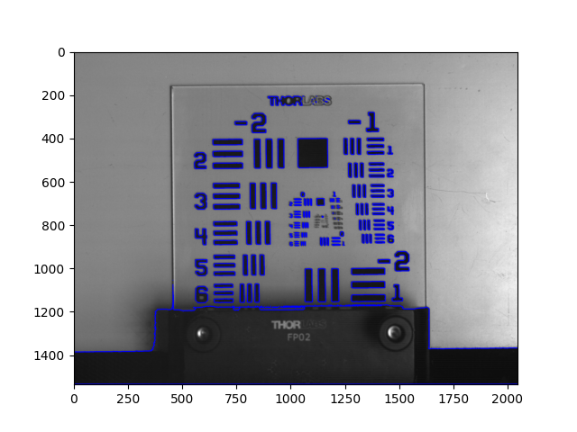
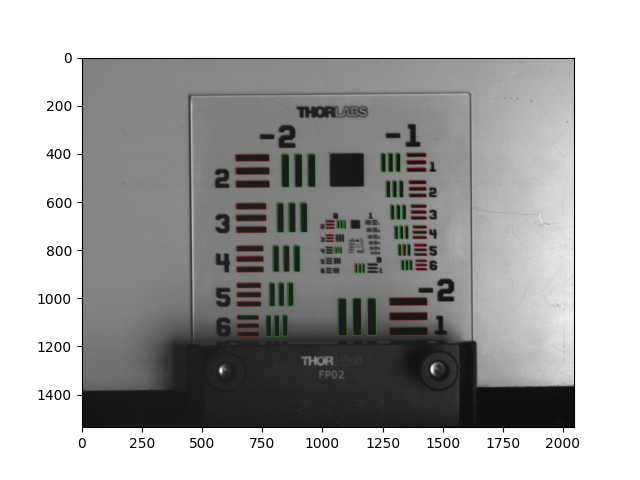
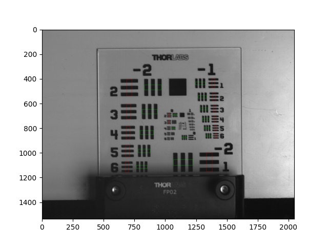
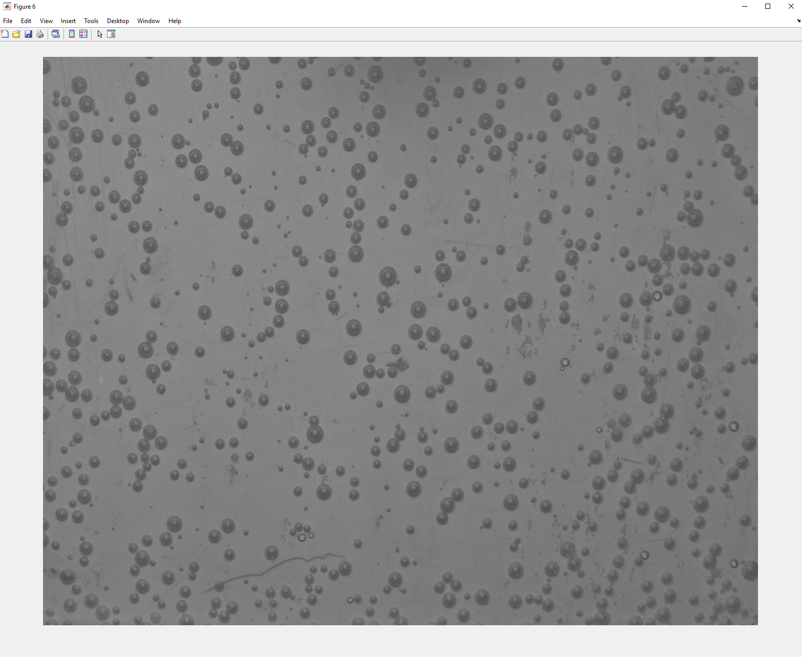
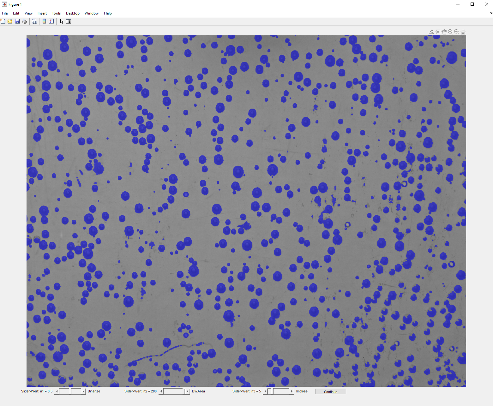
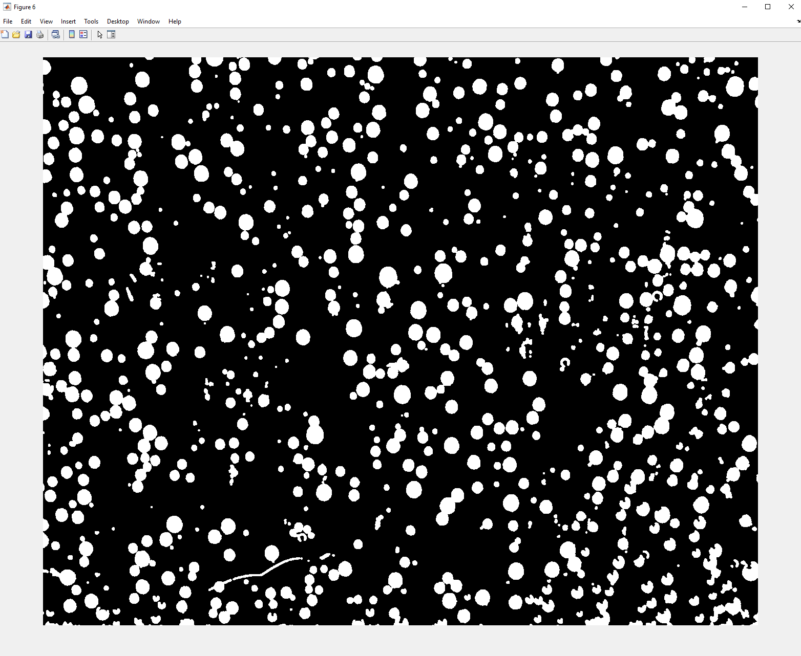

# Abschlussarbeiten

Dieses Repository enthält die Dokumentation und Ergebnisse meiner drei Abschlussarbeiten: Bachelorarbeit, Masterarbeit und Studienarbeit (Projektarbeit).

> **Hinweis:** Die Programmiercodes können aus Datenschutzgründen nicht veröffentlicht werden. Diese README stellt das Konzept und die Herangehensweise der entwickelten Algorithmen und Pipelines dar.

---

## Masterarbeit

**Entwicklung eines Computer-Vision-Algorithmus in Python (OpenCV)**

### Leistungen

- Steigerung der Auswertungseffizienz um über **99%**
- Reduzierung der Analysezeit von **30 Minuten auf unter 10 Sekunden**

### Kontext

Diese Masterarbeit befasste sich mit der Anwendung einer 3D Lichtfeldkamera für fluiddynamische Untersuchungen in verfahrenstechnischen Prozessen.

### Programmierungskonzept

Zur Bewertung der Lichtfeldkamera wurde ein vollständig automatisierter Computer-Vision-Algorithmus in Python mit OpenCV entwickelt.

- **Automatisierte Konturerkennung:** Einsatz von OpenCV zur Erkennung und Analyse der Objektkonturen im Bild. Damit konnte gezielt die Auflösung der Lichtfeldkamera bestimmt werden.
- **Verwendung von Regions of Interest (ROI):** Automatische Festlegung und Auswertung von relevanten Bildbereichen (ROI) auf Basis der Objektsegmentierung, um reproduzierbare und vergleichbare Messergebnisse zu erzielen.

  
USAF Target für Auflösungstests: Das USAF (United States Air Force) Testbild dient zur Bestimmung der räumlichen Auflösung der Lichtfeldkamera. Dies ist ein kritischer Schritt zur Validierung der Kameraqualität vor den fluiddynamischen Messungen.

  
Konturerkennung aller Objekte (blau) mittels cv2.findContours() auf
das grauskalierte, invertierte Bild mit Schwellenwert.

  
Konturenerkennung der Balken untergliedert in Vertikale (rot) und
Horizontale (grün) durch Ähnlichkeitsbeziehungen wie Fläche, Breite, Höhe und Position.

  
Reproduzierbarkeit der Messergebnisse durch ROI, die auf der Breite
für horizontale Balken und auf der Höhe für vertikale Balken basiert.

---

## Studienarbeit (Projektarbeit)

**Entwicklung einer Pipeline zur Clusteranalyse großer Datensätze**

### Leistungen

- Entwicklung eines Peak-Detektionsalgorithmus zur Rauschfilterung
- Automatisierte Clusteranalyse für große Datensätze

### Kontext

Untersuchung der strukturellen und Transporteigenschaften von hochkonzentrierten wässrigen Elektrolytlösungen mithilfe von Molekulardynamik-Simulationen. Die Analyse umfasste Konzentrationen unterhalb und oberhalb des Löslichkeitslimits.

### Programmierungskonzept

Zur Auswertung der Molekulardynamik-Simulationen wurde eine vollständig automatisierte Pipeline zur Clusteranalyse entwickelt:

- **Peak-Detektionsalgorithmus:** Vorgeschalteter Algorithmus zur Rauschfilterung und Signalverarbeitung. Der Algorithmus identifiziert relevante Peaks in den Simulationsdaten und filtert Rauschen, um die Datenqualität für die nachfolgende Clusteranalyse sicherzustellen
- **Automatisierte Clusteranalyse:** Entwicklung einer Pipeline zur Analyse großer Datensätze aus Molekulardynamik-Simulationen. Der Algorithmus identifiziert automatisch Cluster von Ionen in den Lösungen, berechnet deren Größe und Verteilung

Eine Präsentation zur Clusteranalyse finden Sie unter:
[Clusteranalyse.pptx](Studienarbeit/Clusteranalyse.pptx)

---

## Bachelorarbeit

**Entwicklung einer Bildverarbeitungs-Pipeline zur Analyse von über 1.000 Bildern pro Versuchsreihe**

### Leistungen

- Automatisierte Analyse von über **1.000 Bildern pro Versuchsreihe**
- Datengrundlage für strategische Modellierung von Foulingkinetiken

### Kontext

Optimierung einer Anlage zur Untersuchung der Foulingkinetik mit synthetischem Meerwasser als Arbeitsfluid. Ziel war die Erhöhung der Reproduzierbarkeit und die Untersuchung von Oberflächenrauheit und Adhäsionskräften an der Grenzfläche zwischen Kristall und Wärmeübertrager.

### Programmierungskonzept

Zur Analyse der Foulingkinetik wurde eine vollständig automatisierte Bildverarbeitungs-Pipeline entwickelt, die über 1.000 Bilder pro Versuchsreihe verarbeitet:

- **Blasenerkennung:** Entwicklung eines Algorithmus zur Detektion von Gasblasen in den Aufnahmen. Der Algorithmus verwendet Schwellenwertverfahren und morphologische Operationen zur Identifikation von Blasen
- **Parameteranpassung:** Automatische oder halbautomatische Anpassung von Verarbeitungsparametern (Schwellenwerte, Filtergrößen) für optimale Detektionsergebnisse unter verschiedenen Versuchsbedingungen
- **Korrelation und Analyse:** Automatische Berechnung der Korrelation zwischen Wärmetransport und Blasenbedeckung aus den analysierten Bilddaten

Die Pipeline stellt die Datengrundlage für die strategische Modellierung von Foulingkinetiken dar und ermöglicht die quantitative Analyse des Foulingprozesses.

  
**Graustufenkonvertierung:** Das ursprüngliche Farbbild wird in ein Graustufenbild konvertiert, um die Datenkomplexität zu reduzieren und die nachfolgende Verarbeitung zu vereinfachen. Diese Konvertierung eliminiert Farbinformationen, die für die Blasenerkennung nicht relevant sind, und reduziert gleichzeitig den Speicherbedarf bei der Verarbeitung von über 1.000 Bildern pro Versuchsreihe.

  
**Parameteranpassung:** Visualisierung der Parameteranpassung für die optimale Blasenerkennung. Der Algorithmus ermöglicht die interaktive Anpassung von Verarbeitungsparametern wie Schwellenwerten, Filtergrößen und morphologischen Operationen. Dies ist entscheidend, da sich die Versuchsbedingungen (Beleuchtung, Blasengröße, Hintergrund) zwischen verschiedenen Versuchsreihen ändern können. Die Parameteranpassung stellt sicher, dass die Blasenerkennung unter allen Bedingungen optimal funktioniert.

  
**Binärisierung für Blasenerkennung:** Ergebnis der Schwellenwertoperation zur Erzeugung eines binären (Schwarz-Weiß) Bildes. Dieses binäre Bild dient als Grundlage für die nachfolgende Analyse der Blaseneigenschaften (Anzahl, Größe, Position, Bedeckungsgrad).
